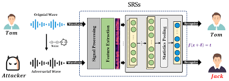

# Adversarial-Automatic-Speaker-Recognition

## Table of Contents
1. [Introduction](#introduction)
2. [Examples](#examples)



## Introduction

This work develop an Automatic Speech Recogniton Framework within an Adversarial Machine Learning context.
Is possible to apply attacks,defenses and trasferability checks.

# Dataset
In particular has been used the SpReW dataset (collected by [MiviaLAB](https://mivia.unisa.it/)).

The dataset has been split between two classes,authorized voices and not authorized voices.

# Models

Two models has been trained on audio splits: Deepspeech and ECAPA-TDNN,used to perform trasferability testing.

# Attacks

The following attacks has been applied:
Generic:
-FGSM
-BIM
-PGD
-DeepFool
-CW
Voice specific:
-FakeBob
-KenanVille
-SirenAttack

# Defenses

Various defense techniques has been applied:
-Adversarial samples Detector
-Adversarial training
-Data Augmentation
-Pre-processing

# Requirements

Install necessary packages through pip:

```python 
pip install -r requirements.txt
```
# Usage Example

run:

```python 
python3 main.py
```

# Example

DeepFool application:


